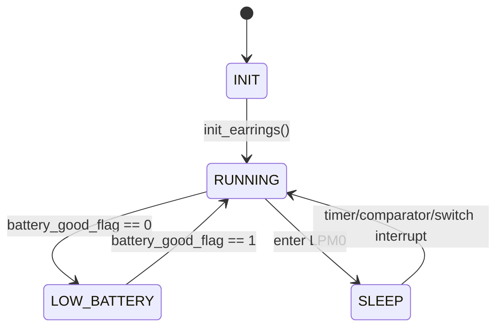
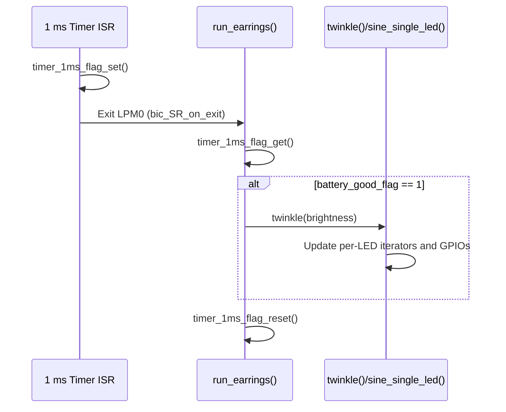
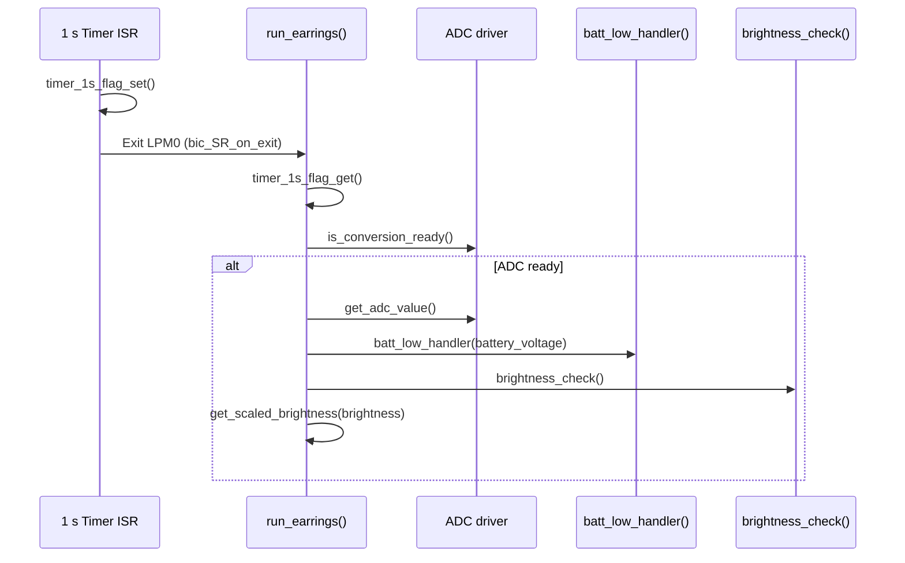

# Runtime State Machines

This document sketches the key state machines and sequences in the firmware based on the current implementation.

## Main Application State Machine

- **INIT**: Hardware and global state are initialised.
- **RUNNING**: Normal operating state; periodic brightness and battery checks plus LED updates.
- **LOW_BATTERY**: Twinkle animation may be disabled and a low-battery LED enabled.
- **SLEEP**: CPU is in low-power mode waiting for interrupts.

## Timer-Driven Animation Sequence

## Battery and Brightness Maintenance Sequence

